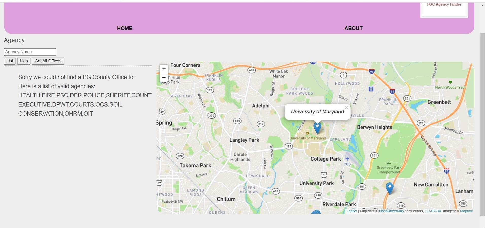

# PGC-Agency-Finder

# About
Many students and faculty coming to the University of Maryland, College Park are unfamilar with PG County. On top of the many stresses of being in an academic environment, finding the nearest PG County Agency to solve their problems can be a daunting task.

To solve this problem I created the PGC Agency Finder which is essentially a full stack web application that can look up PG County's Government Agencies.

The application works by entering the agency of interest, which results in a list being populated with the desired agencies. The list itself will display the name of the office,its address, and its agency. There is also a map function, which will display the location of each populated agency with the accompanying information in a pop-up banner. Furthermore, the "Get All Offices" button can be used to get all agencies on the map and in the list. Possble agencies users can enter are HEALTH, DPWT, COURTS, OCS, SOIL CONSERVATION, FIRE, PSC, DER, POLICE, SHERIFF, COUNTY EXECUTIVE, OHRM, and OIT.

# Documentation
This web application was done using HTML, CSS, JavaScript, APIs, JSON file, Leaflet, Express, and Node.Js. I used HTML and CSS for the overall design of the website and then used JavaScript for the user interactions with the web application. All end points are expecting a JSON object/form object with the key agency and an agency bound to that key.  Only end point that does not rely on the input is the GET route.
Example of JSON object: { agency: 'FIRE' } will cause endpoints to read the agency as FIRE. Key must be 'agency'. Value is not case sensitive. FiRE or fire or any case variation will still be read as FIRE.
GET is used to get all offices and return that to the list and map. Returns all offices in a JSON object un filtered.
PUT is used to populate the list of offices with offices of interest based on agency. Returns a filtered JSON object with office: description, address, city, agency.
POST is used to get all offices of interest and return information needed to generate map points. Returns a filtered JSON object with office: description, address, city, agency, longitude, latitude. POST includes long and lat PUT does not.

The web application was deployed on Microsoft Azure: https://pgcagencyfinder.azurewebsites.net/

# Result when opening the application

# Result when clicking "Get All Offices" button

# Result when a valid agency is entered and the "List" button is chosen

# Result when an invalid agency is entered and "List" button is chosen

# Result when a valid agency is entered and the 'Map' button is chosen

# Result when About Navigation button is chosen

